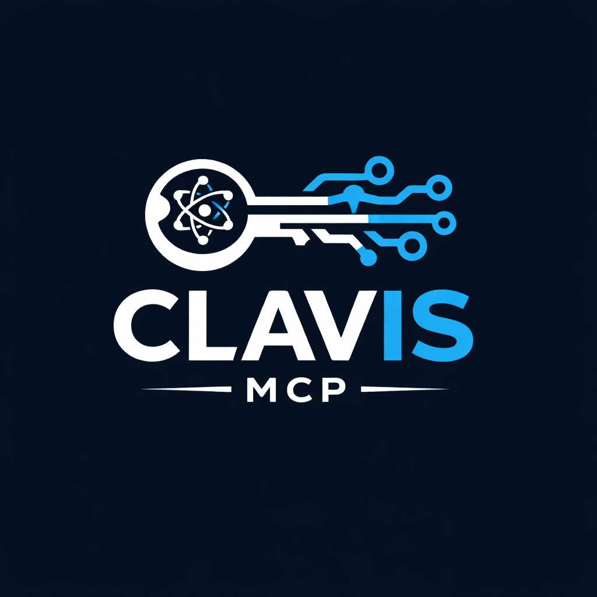
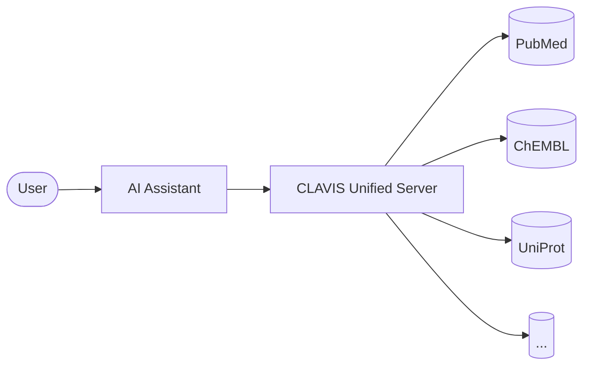

<div align="center">



# CLAVIS

**Unlocking Biomedical Knowledge for AI**

*A Java-based ecosystem of MCP servers providing AI assistants with direct access to 15+ biomedical databases*

[]()
[]()
[](LICENSE)
[]()

[Quick Start](#-quick-start) · [Get API Keys](docs/signup.md) · [API Reference](docs/api-reference.md) · [Usage Guide](docs/usage.md)

</div>

---

## 🧬 Overview

### The Problem
Researchers waste hours manually searching disparate biomedical databases with different interfaces, query languages, and APIs. AI assistants often hallucinate facts instead of looking them up.

### The Solution
CLAVIS (Latin for "key") provides AI assistants like **Claude**, **ChatGPT**, and **Cursor** with direct access to real-time biomedical data through the **Model Context Protocol (MCP)**.



---

## 🗄️ Supported Databases

| Server | Database | Description / Records | API Key | Status |
|:---|:---|:---|:---:|:---:|
| `clavis-pubmed` | [PubMed](https://pubmed.ncbi.nlm.nih.gov/) | 36M+ papers, life science journals | [Opt](docs/signup.md) | ✅ Ready |
| `clavis-semanticscholar` | [Semantic Scholar](https://www.semanticscholar.org/) | 200M+ papers, AI-powered | [Opt](docs/signup.md) | ✅ Ready |
| `clavis-clinicaltrials` | [ClinicalTrials.gov](https://clinicaltrials.gov/) | 470K+ trials, world's largest DB | None | ✅ Ready |
| `clavis-chembl` | [ChEMBL](https://www.ebi.ac.uk/chembl/) | 2.4M+ bioactive compounds | None | ✅ Ready |
| `clavis-pubchem` | [PubChem](https://pubchem.ncbi.nlm.nih.gov/) | 100M+ compounds, chemical properties | None | ✅ Ready |
| `clavis-uniprot` | [UniProt](https://www.uniprot.org/) | 250M+ proteins, sequences/function | None | ✅ Ready |
| `clavis-kegg` | [KEGG](https://www.kegg.jp/) | 500K+ pathways, genes, genomes | None | ✅ Ready |
| `clavis-europepmc` | [Europe PMC](https://europepmc.org/) | 40M+ papers, patents, preprints | None | ✅ Ready |
| `clavis-arxiv` | [arXiv](https://arxiv.org/) | 2.4M+ preprints, AI/Physics | None | ✅ Ready |
| `clavis-reactome` | [Reactome](https://reactome.org/) | 15K+ pathways, diagram data | None | ✅ Ready |
| `clavis-alphafold` | [AlphaFold](https://alphafold.ebi.ac.uk) | 200M+ AI-predicted 3D structures | None | ✅ Ready |
| `clavis-dbsnp` | [dbSNP](https://www.ncbi.nlm.nih.gov/snp) | 650M+ genetic variants/freqs | None | ✅ Ready |
| `clavis-openfda` | [OpenFDA](https://open.fda.gov/apis) | 10M+ adverse event reports, recalls | [Opt](docs/signup.md) | ✅ Ready |
| `clavis-dailymed` | [DailyMed](https://dailymed.nlm.nih.gov/dailymed/services) | 140K+ official FDA drug labels | None | ✅ Ready |
| `clavis-intact` | [IntAct](https://www.ebi.ac.uk/intact) | 1M+ molecular interactions | None | ✅ Ready |
| `clavis-rxnorm` | [RxNorm](https://rxnav.nlm.nih.gov) | 100K+ standardized drug names | None | ✅ Ready |
| `clavis-opentargets` | [Open Targets](https://platform.opentargets.org) | 60K+ gene/disease targets | None | ✅ Ready |
| `clavis-clinvar` | [ClinVar](https://www.ncbi.nlm.nih.gov/clinvar) | 2M+ genetic variants, disease links | None | 📜 Planned |
| `clavis-string` | [STRING](https://string-db.org) | 67M+ protein interaction networks | None | 📜 Planned |
| `clavis-pdb` | [PDB](https://www.rcsb.org) | 220K+ experimental 3D structures | None | 📜 Planned |
| `clavis-gwas` | [GWAS Catalog](https://www.ebi.ac.uk/gwas) | 500K+ gen-variant associations | None | 📜 Planned |
| `clavis-hpa` | [Human Protein Atlas](https://www.proteinatlas.org) | 20K+ proteins, tissue expression | None | 📜 Planned |
| `clavis-ensembl` | [Ensembl](https://rest.ensembl.org) | Full human/multi-species genomes | None | 📜 Planned |
| `clavis-biorxiv` | [bioRxiv/medRxiv](https://api.biorxiv.org) | 240K+ research preprints | None | 📜 Planned |
| `clavis-chebi` | [ChEBI](https://www.ebi.ac.uk/chebi) | 60K+ chemical biology metabolites | None | 📜 Planned |
| `clavis-pharmgkb` | [PharmGKB](https://api.pharmgkb.org) | 50K+ pharmacogenomic relationships | None | 📜 Planned |
| `clavis-medlineplus` | [MedlinePlus](https://medlineplus.gov) | 40K+ patient-friendly help topics | None | 📜 Planned |
| `clavis-nci` | [NCI Thesaurus](https://evsrestapi.nci.nih.gov) | 170K+ authoritative cancer terms | None | 📜 Planned |
| `clavis-hmdb` | [HMDB](https://hmdb.ca) | 220K+ human body metabolites | None | ✅ Ready |
| `clavis-biogrid` | [BioGRID](https://webservice.thebiogrid.org) | 2M+ curated bio-interactions | Free Key | 📜 Planned |
| `clavis-crossref` | [Crossref](https://api.crossref.org) | 140M+ publications with DOIs | None | 📜 Planned |
| `clavis-core` | [CORE](https://core.ac.uk/api-v2/) | 200M+ open access papers | None | 📜 Planned |
| `clavis-worldbank` | [World Bank](https://api.worldbank.org/v2/) | 1,400+ health indicators | None | 📜 Planned |
| `clavis-civic` | [CIViC](https://civicdb.org) | 10K+ cancer variants, clinical evidence | None | 📜 Planned |
| `clavis-gnomad` | [gnomAD](https://gnomad.broadinstitute.org) | 140K+ genomes, variant frequencies | None | 📜 Planned |
| `clavis-gtex` | [GTEx](https://gtexportal.org) | Gene expression across 54 human tissues | None | 📜 Planned |
| `clavis-omim` | [OMIM](https://www.omim.org) | 25K+ genetic disorders, gold standard | None | 📜 Planned |
| `clavis-hgnc` | [HUGO](https://www.genenames.org) | 45K+ official gene symbols and names | None | 📜 Planned |
| `clavis-refseq` | [RefSeq](https://www.ncbi.nlm.nih.gov/refseq) | Standard gene/protein reference sequences | None | 📜 Planned |
| `clavis-decipher` | [DECIPHER](https://www.deciphergenomics.org) | Rare disease variants and phenotypes | None | 📜 Planned |
| `clavis-pharmvar` | [PharmVar](https://www.pharmvar.org) | Pharmacogene variations, star alleles | None | 📜 Planned |
| `clavis-sider` | [SIDER](http://sideeffects.embl.de) | 140K+ drug-side effect pairs | None | 📜 Planned |
| `clavis-stitch` | [STITCH](http://stitch.embl.de) | 9.6M+ chemical-protein interactions | None | 📜 Planned |
| `clavis-superdrug` | [SuperDRUG2](http://cheminfo.charite.de/superdrug2) | 4.6K+ approved/investigational drugs | None | 📜 Planned |
| `clavis-drugcentral` | [DrugCentral](https://drugcentral.org) | 4.5K+ drugs with pharmacology/targets | None | 📜 Planned |
| `clavis-ctd` | [CTD](http://ctdbase.org) | Chemical-gene-disease relationships | None | 📜 Planned |
| `clavis-bindingdb` | [BindingDB](https://www.bindingdb.org) | 2.5M+ drug-target binding affinities | None | 📜 Planned |
| `clavis-zinc` | [ZINC](https://zinc.docking.org) | 750M+ purchasable compounds | None | 📜 Planned |
| `clavis-swissmodel` | [SWISS-MODEL](https://swissmodel.expasy.org) | 4M+ protein homology models | None | 📜 Planned |
| `clavis-emdb` | [EMDB](https://www.ebi.ac.uk/emdb) | 40K+ Cryo-EM protein structures | None | 📜 Planned |
| `clavis-bmrb` | [BMRB](http://www.bmrb.io) | 15K+ NMR spectroscopy data entries | None | 📜 Planned |
| `clavis-interpro` | [InterPro](https://www.ebi.ac.uk/interpro) | Functional protein families and domains | None | 📜 Planned |
| `clavis-pfam` | [Pfam](https://www.ebi.ac.uk/interpro) | Protein families and conserved domains | None | 📜 Planned |
| `clavis-wikipathways` | [WikiPathways](https://www.wikipathways.org) | 3K+ community-curated pathways | None | 📜 Planned |
| `clavis-pathwaycommons` | [Pathway Commons](https://www.pathwaycommons.org) | Integrated pathway meta-database | None | 📜 Planned |
| `clavis-metacyc` | [MetaCyc](https://metacyc.org) | 3K+ experimentally validated pathways | None | 📜 Planned |
| `clavis-brenda` | [BRENDA](https://www.brenda-enzymes.org) | 8K+ enzymes, function and kinetics | None | 📜 Planned |
| `clavis-cosmic` | [COSMIC](https://cancer.sanger.ac.uk/cosmic) | 10M+ cancer mutations and study data | None | 📜 Planned |
| `clavis-alzforum` | [AlzForum](https://www.alzforum.org) | Alzheimer's genes, drugs, and models | None | 📜 Planned |
| `clavis-malacards` | [MalaCards](https://www.malacards.org) | 22K+ integrated disease compendium | None | 📜 Planned |
| `clavis-icd11` | [ICD-11](https://icd.who.int) | 17K+ international disease codes | None | 📜 Planned |
| `clavis-snomed` | [SNOMED CT](https://www.snomed.org) | 350K+ clinical terminology standard | None | 📜 Planned |
| `clavis-mesh` | [MeSH](https://www.nlm.nih.gov/mesh) | 30K+ biomedical indexing terms | None | 📜 Planned |

---

## 🚀 Quick Start (Installation)

1. **Clone the repository**
   ```bash
   git clone https://github.com/ladybugsaga/CLAVIS.git
   cd CLAVIS
   ```

2. **Build the project**
   ```bash
   mvn clean install
   ```

3. **Configure Environment** (Optional)
   ```bash
   cp .env.example .env
   # Add your API keys for higher rate limits
   ```

---

## ⚙️ Connection & Configuration

To use CLAVIS with an AI assistant, you must point it to the **Unified Server** JAR file.

### Claude Desktop Setup

Add the following configuration to your `claude_desktop_config.json`:

> [!IMPORTANT]
> Replace `/PATH/TO/CLAVIS/` with the actual absolute path to your cloned repository.

```json
{
  "mcpServers": {
    "clavis-unified": {
      "command": "java",
      "args": [
        "-Dlogback.statusListenerClass=ch.qos.logback.core.status.NopStatusListener",
        "-jar",
        "/PATH/TO/CLAVIS/clavis-unified/target/clavis-unified-1.0.0-SNAPSHOT.jar"
      ],
      "disabled": false,
      "timeout": 60,
      "type": "stdio"
    }
  }
}
```

---

## 🧪 Verification

Restart your AI assistant and use the following test prompt to verify that all systems are integrated:

> **Test Prompt**: *"Research the drug Metformin. First, find its mechanism of action using ChEMBL. Then, search PubMed for clinical trials from 2024 related to its use in 'aging'. Finally, check if there are any related protein pathways in Reactome."*

---

## 🏗️ Architecture & Documentation

CLAVIS is built on a robust, multi-module Java architecture designed for speed and reliability.

- **16 Maven modules** — 1 core + 15 database servers
- **Token bucket rate limiting** — Intelligent handling of API quotas
- **In-memory TTL cache** — Optimized performance for repeated queries
- **Unified Server** — All 15 modules in a single process to save RAM

### 📖 Key Resources
- **[Installation Guide](docs/installation.md)**
- **[API Reference](docs/api-reference.md)**
- **[Usage Guide (Cursor, VS Code, etc.)](docs/usage.md)**
- **[Contributing](CONTRIBUTING.md)**

---

<div align="center">

**Built with ❤️ for the biomedical research community**

*CLAVIS — Every database, one protocol*

</div>